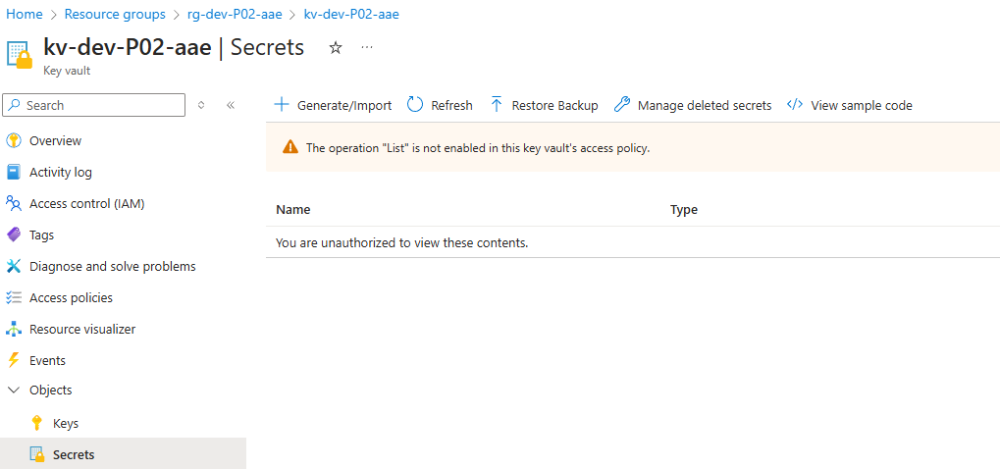
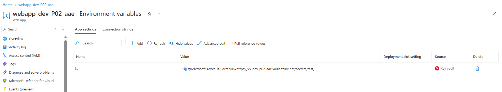

**Local setup**

- Open git bash sheel
- Change dir to ./environments/dev i.e. `cd environments/dev`
- In order to configure remote storage accound details run command  
   `source test.sh`
- Run `terraform init -upgrade`
- Execute `terraform validate` ( Optional )
- Execute `terraform plan -out main.tfplan`
- Execute `terraform apply main.tfplan`
- Execute `terraform plan -destroy -out main.destroy.tfplan`
- Execute `terraform apply main.destroy.tfplan`

**Authenticating to Azure using a Service Principal with a Client Secret**

 - az login 
 - az account list 
 - az account set --subscription="subid"
 - az ad sp create-for-rbac --role="Contributor" --scopes="subscriptions/subid"  --display-name="SPN_TF_IAC_KV_UMI_ENTRA_GROUP_POC"
  <pre>{
        "appId": "",
        "displayName": "",
        "password": "",
        "tenant": ""
    }
}</pre>
- az login --service-principal -u CLIENT_ID -p CLIENT_SECRET --tenant TENANT_ID

## Configuring remote state

When we try to run following command 
`terraform init` first time we will get following error.

<pre>
Initializing the backend...
╷
│ Error: unable to build authorizer for Resource Manager API: could not configure AzureCli Authorizer: tenant ID was not specified and the default tenant ID could not be determined: obtaining tenant ID: obtaining account details: running Azure CLI: exit status 1: ERROR: No subscription found. Run 'az account set' to select a subscription.
</pre>

This indicates we are not logged in.  

*Option 1*

Loing to git console using following command 
`az login --service-principal -u CLIENT_ID -p CLIENT_SECRET --tenant TENANT_ID`

After logging in upon executing `terraform init` we wil see following error 

<pre>
$ terraform init
Initializing the backend...
╷
│ Error: retrieving Storage Account (Subscription: ""
│ Resource Group Name: "rg-tfstate"
│ Storage Account Name: "hftfstate"): unexpected status 400 (400 Bad Request) with error: InvalidSubscriptionId: The provided subscription identifier 'resourceGroups' is malformed or invalid.
</pre>

In order to fix this run following command.  

`export ARM_SUBSCRIPTION_ID="YOUR-SUBCRIPTION-ID"`

run `terraform init`  We should get following output 

<pre>
$ terraform init
Initializing the backend...
Initializing provider plugins...
- Reusing previous version of hashicorp/random from the dependency lock file
- Reusing previous version of hashicorp/azurerm from the dependency lock file
- Using previously-installed hashicorp/random v3.7.1
- Using previously-installed hashicorp/azurerm v4.21.1

Terraform has been successfully initialized!

You may now begin working with Terraform. Try running "terraform plan" to see
any changes that are required for your infrastructure. All Terraform commands
should now work.

If you ever set or change modules or backend configuration for Terraform,
rerun this command to reinitialize your working directory. If you forget, other
commands will detect it and remind you to do so if necessary.
</pre>

*Option 2*

This is simeple and my prefered way to autheticate against Azure by configuring following 4 environment variables
 - export ARM_SUBSCRIPTION_ID="sub here"
 - export ARM_TENANT_ID="tenant id here"
 - export ARM_CLIENT_ID="clientid"
 - export ARM_CLIENT_SECRET="secret here"

At this stage we are successfully autheticated and ready to create resources.

## Keyvault Configuration

Once key vault is created its not accessible to anyone

>The Key Vault Contributor role is for control plane operations only to manage key vaults. It does not allow access to keys, secrets and certificates. More information [here](https://learn.microsoft.com/en-us/azure/key-vault/general/rbac-guide?tabs=azure-cli)

After configuring RBACK role - `` for UMI we can configure environment variable in WebApp using [KeyVault Reference](https://learn.microsoft.com/en-us/azure/app-service/app-service-key-vault-references?tabs=azure-cli).

